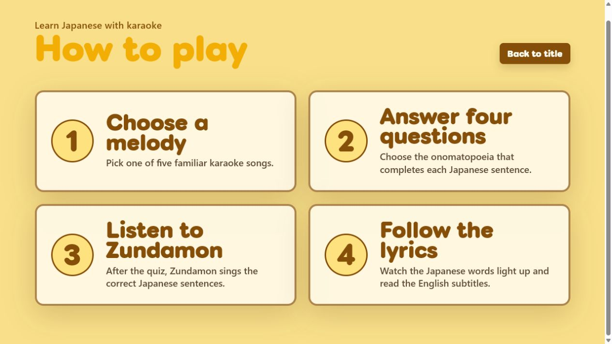
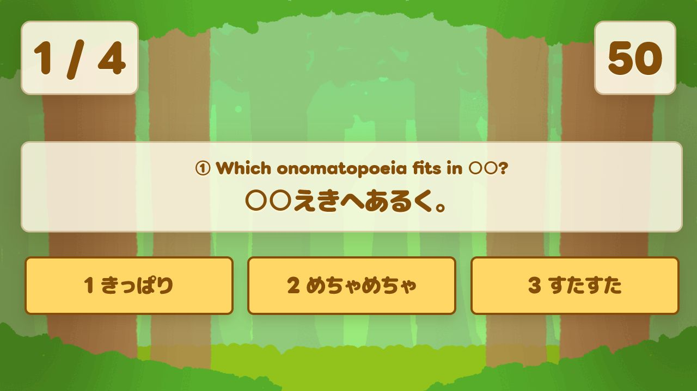
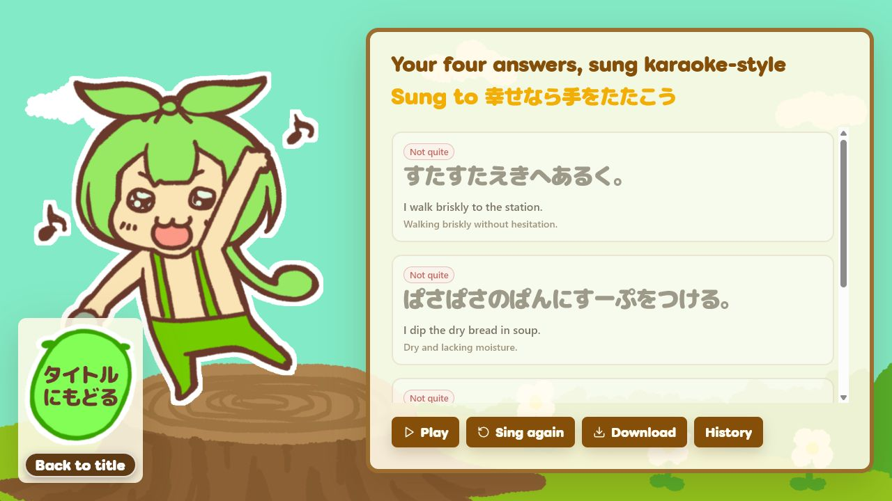

# SingLink

**A Japanese-learning web app inspired by karaoke culture: answer four onomatopoeia quizzes, then hear Zundamon sing the correct Japanese example sentences while the lyrics light up in time and English subtitles explain them.**

[日本語 README](README.ja.md) · [Demo video](https://youtu.be/B1NkSrOzdA8) · [Judge quick start](docs/judge-testing-guide.md) · [Build Week development record](docs/build-week-development.md) · [Third-party notices](THIRD_PARTY_NOTICES.md)

## Try the live demo (no setup)

[Start the fixed four-question demo on GitHub Pages](https://hachi-mori.github.io/SingLink-Parody-Song-Maker/openai-build-week/?demo=1). It loads the four fixed questions immediately and needs neither a local server nor a running VOICEVOX instance. After the quiz, play the bundled, pre-generated Zundamon singing and accompaniment with karaoke highlighting. The title page at the [public Build Week URL](https://hachi-mori.github.io/SingLink-Parody-Song-Maker/openai-build-week/) also provides a `Try fixed quiz demo` button.

This is a reproducible presentation path, not real-time generation: its song is the same pre-generated sample regardless of quiz input. For an answer-derived singing result, use the local Windows path with VOICEVOX described below.

## Watch the OpenAI Build Week demo video

[](https://youtu.be/B1NkSrOzdA8)

[Watch the 2 minute 47 second OpenAI Build Week demo video on YouTube](https://youtu.be/B1NkSrOzdA8). It introduces the English Web app, the fixed public demo, karaoke playback, the 335-record learning-data work, and how Codex and GPT-5.6 supported the development workflow.

## Screenshots

| How to play | Four-question quiz | Karaoke result |
| --- | --- | --- |
|  |  |  |

## The problem

Japanese onomatopoeia such as *wakuwaku*, *shitoshito*, and *kirakira* are memorable in context but difficult to retain as isolated vocabulary. A learner also needs to connect the written expression, its meaning, and the rhythm of a natural Japanese sentence.

SingLink turns that review into a short karaoke-style experience. The learner does **not** sing. The learner answers four Japanese fill-in-the-blank questions; **Zundamon sings the four correct example sentences**. The app highlights the Japanese lyrics from the same Score frames used for synthesis, while the English mode adds a translation and a concise meaning.

This is an **Education** track project. It uses karaoke presentation as a memory aid, not as a singing assessment.

## How normal mode works

1. Choose one of five source melodies.
2. Answer four randomly selected Japanese onomatopoeia questions.
3. SingLink builds a four-phrase Score from the correct sentences.
4. A local VOICEVOX instance synthesizes Zundamon's voice.
5. The result player starts voice and accompaniment together and highlights Japanese characters from each note's `frame_length` at 93.75 fps.
6. English mode shows an English example and meaning below each Japanese line. Japanese mode omits that English support.

The included dataset contains 335 onomatopoeia learning records with newly written examples, meanings, singing readings, and English support. No account, API key, or cloud database is required.

## Main features

- 335 Japanese onomatopoeia records with newly written example sentences, singing readings, English examples, and meanings
- Four random questions per play
- Five selectable source melodies
- English-first UI with a persistent English/Japanese switch
- Four-step English “How to play” screen
- Score-derived, character-level karaoke highlighting; no fixed display timer
- Play, pause, resume, and restart controls
- Server-proxied and browser-direct local VOICEVOX paths
- Voice result history stored in the browser with IndexedDB
- Responsive layouts checked at 1280×720, 820×1180, and 390×844
- Reduced-motion support while preserving lyric timing
- Fixed-question demo with four original examples sung to the in-project `幸せなら手をたたこう` score and accompaniment, pre-generated with `VOICEVOX:ずんだもん`

## What was built during OpenAI Build Week

[OpenAI Build Week on Devpost](https://openai.devpost.com/) lists the submission period as July 13, 2026 09:00 PT through July 21, 2026 17:00 PT. The last commit before that window is [`c1aab5f`](https://github.com/hachi-mori/SingLink-Parody-Song-Maker/commit/c1aab5fac5e139ce10ffc8532fd655cbddbade81).

### Before the submission period

- The existing SingLink C++ / Siv3D application
- The basic Web port and screen flow
- Replacement-song generation and local VOICEVOX integration
- Browser-local generation history

The C++ / Siv3D application remains in the repository for history and reference; it is not the main Build Week submission target.

### Added during the submission period

- [`2916f58`](https://github.com/hachi-mori/SingLink-Parody-Song-Maker/commit/2916f58): ported dynamic onomatopoeia Score generation to the Web app
- [`416fe42`](https://github.com/hachi-mori/SingLink-Parody-Song-Maker/commit/416fe42): added five selectable source melodies
- [`f7da284`](https://github.com/hachi-mori/SingLink-Parody-Song-Maker/commit/f7da284): connected 100 onomatopoeia records to both questions and singing
- [`759273d`](https://github.com/hachi-mori/SingLink-Parody-Song-Maker/commit/759273d): removed publisher-derived submission text and replaced it with newly written examples, meanings, and singing readings
- [`67e63f8`](https://github.com/hachi-mori/SingLink-Parody-Song-Maker/commit/67e63f8): expanded that newly written learning content to 335 vocabulary records
- [`2391294`](https://github.com/hachi-mori/SingLink-Parody-Song-Maker/commit/2391294): added English learning data, i18n, subtitle auditing, and Score-derived karaoke timing
- [`a654981`](https://github.com/hachi-mori/SingLink-Parody-Song-Maker/commit/a654981): changed a play session to four questions and added note-level lyric progress
- [`44d87fc`](https://github.com/hachi-mori/SingLink-Parody-Song-Maker/commit/44d87fc) through [`2ae471f`](https://github.com/hachi-mori/SingLink-Parody-Song-Maker/commit/2ae471f): refined wide, portrait, mobile, English-first, and language-specific presentation
- [`d33da28`](https://github.com/hachi-mori/SingLink-Parody-Song-Maker/commit/d33da28): added the pre-generated, VOICEVOX-free demo bundle
- [`019a132`](https://github.com/hachi-mori/SingLink-Parody-Song-Maker/commit/019a132): made the demo a fixed four-question quiz that leads to its bundled result
- [`2bc0f00`](https://github.com/hachi-mori/SingLink-Parody-Song-Maker/commit/2bc0f00): switched that sample to the existing `幸せなら手をたたこう` score and accompaniment

The complete timeline and evidence are in [docs/build-week-development.md](docs/build-week-development.md).

## How Codex and GPT-5.6 were used

Codex with GPT-5.6 helped trace the legacy C++ behavior, port the score transformation, structure and cross-check 335 learning records, validate 335 records across five songs, add English UI and subtitle auditing, derive karaoke timing from VOICEVOX Score frames, exercise three responsive widths, and review the final changes.

The work was collaborative rather than automatic. A parent GPT-5.6 Sol agent integrated the design, implementation, verification, and commits. GPT-5.6 Terra agents performed bounded read-only research, focused implementation tasks, and independent review. Generated suggestions were checked against the code, Git history, tests, browser behavior, and VOICEVOX output before being retained.

### Human decisions

The project owner decided:

- to use Japanese karaoke culture as the learning metaphor;
- that the learner answers but Zundamon sings;
- that Japanese remains the learning target and English remains support;
- to remove publisher-derived text and write new examples, meanings, and singing readings;
- to start the submission branch in English;
- to use real Score frames, rather than a fixed timer, for highlighting; and
- to provide a clearly labeled fixed public demo while keeping answer-derived generation as the normal mode; and
- how the layout should respond on wide, portrait, and mobile screens.

Codex session identifiers are not inferred from Git history. The owner must enter the exact ID returned by `/feedback` in the Devpost submission.

## Architecture

| Area | Implementation |
| --- | --- |
| Client | React 19, TypeScript, Vite |
| Server | Fastify, TypeScript |
| Shared logic | Dataset parsing, kana/mora handling, Score generation, timing, WAV processing |
| Speech/singing | Local VOICEVOX; tested with 0.25.1 and Zundamon |
| Persistence | Browser IndexedDB; no server database |
| Assets | Local dictionaries, five Score files, five accompaniment WAV files, UI textures, and a pre-generated demo manifest/WAV |

The client normally uses the local Fastify server. A browser-direct VOICEVOX path also exists for compatible local deployments. Both paths share the same Score and phrase plan.

## Quick start (Windows)

Requirements:

- Windows
- Node.js `^20.19.0` or `>=22.12.0` (Node.js 22 recommended)
- npm
- [VOICEVOX](https://voicevox.hiroshiba.jp/) running locally for synthesized singing; version 0.25.1 is the verified version

```powershell
git clone https://github.com/hachi-mori/SingLink-Parody-Song-Maker.git
cd SingLink-Parody-Song-Maker
git switch openai-build-week
cd web
npm ci
npm.cmd run dev
```

Open [http://127.0.0.1:5173/](http://127.0.0.1:5173/). The client runs on port 5173, the local API server on port 5174, and the default VOICEVOX endpoint is `http://localhost:50021`.

The repository already includes the 335-record sample dataset and the five local song assets; no demo account or environment file is needed. Choose `Try fixed quiz demo` (or open `http://127.0.0.1:5173/?demo=1`) to answer four fixed questions and then inspect the bundled singing, subtitles, and karaoke timing without running VOICEVOX. The screen identifies it as pre-generated; quiz input does not produce a new demo audio file. Normal mode still generates singing in real time from quiz answers. See the [judge testing guide](docs/judge-testing-guide.md) for the shortest test path and expected states.

## VOICEVOX setup

1. Install VOICEVOX from its [official site](https://voicevox.hiroshiba.jp/).
2. Start VOICEVOX before starting the test.
3. Leave the title-screen URL as `http://localhost:50021` unless the engine uses another address.
4. Confirm that the title screen reports a successful connection.

To override the server default:

```powershell
$env:VOICEVOX_BASE_URL = "http://localhost:50021"
npm.cmd run dev
```

The quiz and text result can still be inspected without VOICEVOX. Full singing synthesis requires the local engine.

## Judge test path

1. Keep `Language` set to `English`.
2. Open `How to play` and confirm the four English steps.
3. Return to the title and choose the onomatopoeia quiz plus any of the five melodies.
4. Answer four questions. Correctness does not block completion.
5. Let SingLink synthesize the four correct sentences, or choose the text-only result if VOICEVOX is unavailable.
6. On the result screen, play the song and confirm four Japanese lyric lines, English examples and meanings, and progressive karaoke highlighting.
7. Pause and resume once, then open `Saved songs` to confirm browser-local history when audio was generated.

## Verification

```powershell
cd web
npm.cmd run test
npm.cmd run typecheck
npm.cmd run build
npm.cmd run audit:english-subtitles
```

Verified on July 19, 2026:

- Vitest: 9 files, 37 tests passed
- TypeScript type-check: passed
- Production Web build: passed
- English subtitle audit: 335/335 present
- VOICEVOX 0.25.1: four-sentence singing synthesis checked on the local path
- Browser: main flow checked at 1280×720, 820×1180, and 390×844
- Browser: instant demo checked at 1440×900, 768×1024, and 375×812; playback and one active karaoke line confirmed

These commands are run again for the submission-document commit; see the final result in [CODEX_STATUS.md](CODEX_STATUS.md).

## Known limitations

- GitHub Pages can serve the static UI and the pre-generated instant demo, but cannot run the Fastify server or create answer-derived VOICEVOX singing by itself. The supported real-time generation path is the local Windows setup above.
- Local VOICEVOX from a phone is not a supported synthesis path.
- There is no user account, cloud synchronization, or server-side history database.
- English learning records are structurally audited, but educational wording should continue to receive human language review.
- The MIT License covers project code, not every bundled asset. Artwork, fonts, audio, Scores, generated voice, and third-party packages retain the conditions documented in [the license scope](LICENSE_SCOPE.md) and [third-party notices](THIRD_PARTY_NOTICES.md).

## Privacy and local storage

SingLink sends normal-mode synthesis requests only to the VOICEVOX URL chosen on the title screen. Generated normal-mode WAV data and its metadata are stored in the browser's IndexedDB. The bundled fixed-demo WAV is fetched as a static asset and is not added to Saved songs. Clearing site data removes generated history. The application does not include analytics, authentication, a cloud database, or an OpenAI API call at runtime.

## License and credits

- Programming: hachi-mori
- Design and artwork: Ryotsu (used with permission)
- Singing voice: **VOICEVOX:ずんだもん**
- Code license: [MIT](LICENSE), copyright © 2025–2026 hachi-mori
- License boundaries: [LICENSE_SCOPE.md](LICENSE_SCOPE.md)
- Web dependencies: see [THIRD_PARTY_NOTICES.md](THIRD_PARTY_NOTICES.md)
- Asset-by-asset evidence status: see [docs/asset-inventory.md](docs/asset-inventory.md)

The MIT License does not relicense Ryotsu's artwork, Futehodo Maru Gothic, VOICEVOX/Zundamon resources, generated voice, music assets, or third-party dependencies. Follow the linked notices when redistributing the project.
