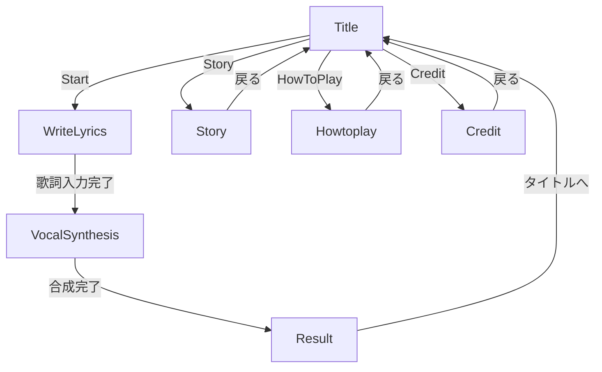

# アプリ仕様メモ

## 1. アプリ概要

- アプリ名: シングリンク
- 技術スタック: C++ / Siv3D / Visual Studio
- 目的（現時点の理解）:
替え歌の歌詞入力を行い、VOICEVOX連携で歌声合成し、結果再生までを行う。

## 2. 画面（Scene）構成

`Main.cpp` の `SceneManager` 登録順:

1. `Title`（タイトル）
2. `WriteLyrics`（歌詞入力）
3. `VocalSynthesis`（歌声生成）
4. `Result`（結果再生）
5. `Story`（ストーリー）
6. `Howtoplay`（あそびかた）
7. `Credit`（クレジット）

## 3. 主なデータ共有（`GameData`）

- 選択中の `vvprojPath`
- 曲タイトル `songTitle`
- 生成済みの歌唱音声 / トーク音声 / インスト音声
- 歌っているキャラ名やスコア情報（`SolvedTask` 配列）
- 最終歌詞 `fullLyrics`
- VOICEVOX接続先 `baseURL`（既定: `http://localhost:50021`）

## 4. 外部連携・ファイル前提

- VOICEVOXエンジンへのHTTPアクセスを利用
- `Score/*.vvproj` を入力候補として扱う
- `Inst/<曲名>.mp3` をインスト音源として参照
- `Texture/assets/*` などのリソースを `Resource(...)` 経由で利用

## 5. 現状前提

- 画面サイズは `1920x1080` 前提（Siv3Dウィンドウ設定）
- 実行は Visual Studio のソリューションから行う

## 6. 今後の追記TODO

- 画面ごとの入力操作と遷移条件
- 歌詞生成/評価ロジックの詳細
- エラーハンドリング方針（VOICEVOX未起動時など）
- 開発者向けビルド・デバッグ手順（VS設定込み）

## 7. ディレクトリ構成（主要部分）

```text
SingLink-Parody-Song-Maker/
├─ AGENTS.md
├─ README.md
├─ docs/
│  └─ app-spec.md
└─ ずんだもんアイドルPJ/
   └─ ずんだもんアイドルPJ/
      ├─ Main.cpp
      ├─ Common.hpp
      ├─ Scene/
      ├─ VOICEVOX/
      └─ App/
         ├─ Inst/
         ├─ Score/
         ├─ Query/
         ├─ Voice/
         ├─ Texture/
         │  └─ assets/
         └─ tmp/
```

## 8. 主に編集しているプログラム（tree）

```text
ずんだもんアイドルPJ/ずんだもんアイドルPJ/
├─ Main.cpp                  # SceneManager登録とアプリ起点
├─ Common.hpp                # 共有データ(GameData)定義
├─ Scene/
│  ├─ Title.cpp / .hpp       # 曲選択・遷移起点
│  ├─ WriteLyrics.cpp / .hpp # 替え歌入力
│  ├─ VocalSynthesis.cpp / .hpp # VOICEVOX合成処理
│  ├─ Result.cpp / .hpp      # 再生・結果表示
│  ├─ Story.cpp / .hpp       # ストーリー画面
│  ├─ Howtoplay.cpp / .hpp   # あそびかた画面
│  └─ Credit.cpp / .hpp      # クレジット画面
└─ VOICEVOX/
   └─ VOICEVOX.cpp / .hpp    # vvproj変換・合成呼び出し
```

## 9. 画面遷移フロー（実装ベース）



補足:

- `Main.cpp` にはデバッグ用の数字キー遷移（1〜7）があり、各シーンへ直接ジャンプ可能。
- 上記フローは `Scene/*.cpp` の `changeScene(...)` 実装を基準に記載。
